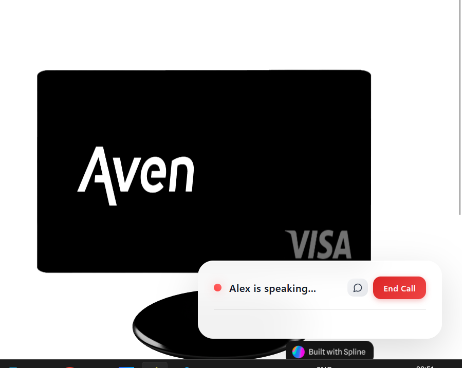
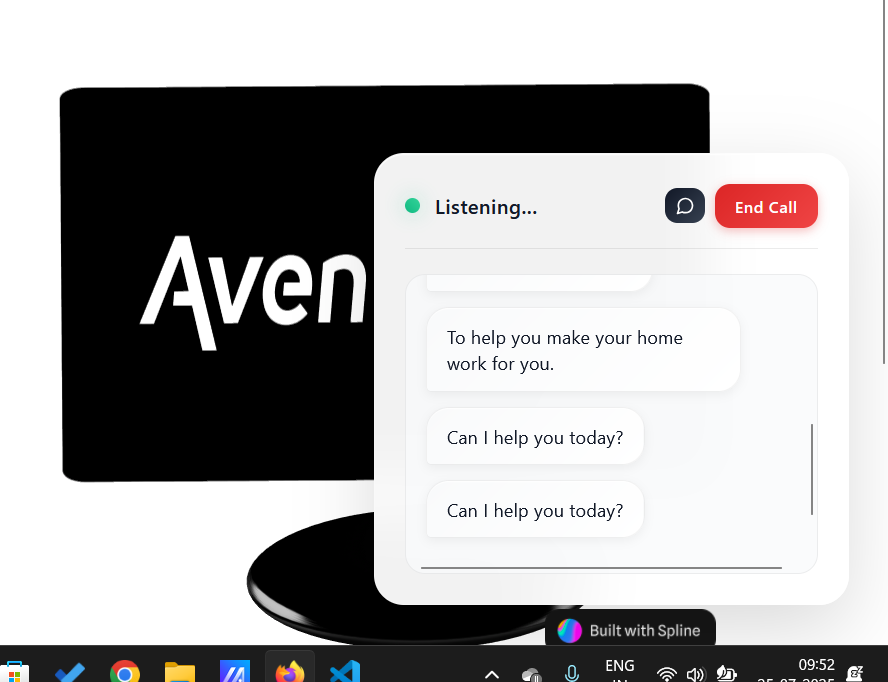
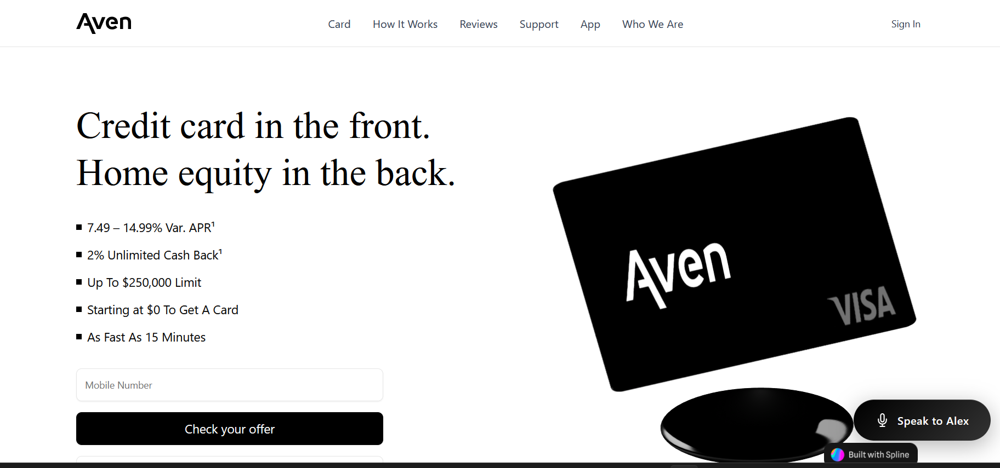

# Aven - AI-Powered Financial Assistant

<p align="center">
  
</p>

Aven is a modern Next.js application featuring an AI-powered financial assistant that helps users with financial questions, especially related to home equity and credit products.

## 🌟 Key Features

<p align="center">
   
   
  
</p>

- **AI Assistant** - Interactive chat interface powered by Google Gemini API
- **Knowledge Base** - Searchable collection of financial documents and resources
- **Next.js 15** - Built with the latest Next.js features including Server and Client Components
- **Modern UI** - Clean, responsive interface using Tailwind CSS
- **Vector Search** - Semantic document search capabilities

## 📋 Project Highlights

<div align="center">
  <div style="display: flex; justify-content: center; align-items: center; gap: 20px; flex-wrap: wrap;">
    
    
  </div>
</div>

This project demonstrates:

- Replacement of OpenAI API with Google's Gemini API
- Proper separation of Server and Client Components in Next.js 15
- Integration with Pinecone vector database for knowledge retrieval
- Implementation of conversational AI for financial advice

## 🚀 Getting Started

First, install the dependencies:

```bash
npm install
```

Set up your environment variables by creating a `.env.local` file:

```bash
# Required environment variables
GEMINI_API_KEY=your_gemini_api_key
PINECONE_API_KEY=your_pinecone_api_key
PINECONE_ENVIRONMENT=your_pinecone_environment
PINECONE_INDEX=your_pinecone_index
```

Then run the development server:

```bash
npm run dev
```

Open [http://localhost:3000](http://localhost:3000) with your browser to see the result.

<p align="center">
  
</p>

## 🛠️ Development Tools

- **Test Gemini API**: Run `npm run test:gemini` to verify your Gemini API integration
- **Setup Knowledge Base**: Run `npm run setup:kb` to process and index documents
- **Test Vector Search**: Run `npm run test:search` to test the semantic search capabilities

## 📁 Project Structure

- `app/` - Next.js application routes and API endpoints
- `components/` - Reusable UI components including the AI assistant
- `data/` - Knowledge base documents and prompt templates
- `lib/` - Utility functions and API integrations
- `public/` - Static assets
- `scripts/` - Helper scripts for development and testing

## 🧪 Testing

The project includes sample test cases in `aven-test-cases.json` for testing the AI assistant's responses to various financial queries.

## 📚 Technology Stack

<p align="center">
  
</p>

- **Next.js 15** - React framework with App Router
- **TypeScript** - Type-safe JavaScript
- **Google Gemini API** - AI model for text generation and embeddings
- **Pinecone** - Vector database for semantic search
- **Tailwind CSS** - Utility-first CSS framework
- **Shadcn UI** - Reusable component library

## 📄 License

This project is licensed under the MIT License - see the LICENSE file for details.
